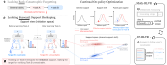

<div align="center">

# Verifier-Induced Support Reshaping in On-Policy Optimization

**Shaohang Wei<sup>1</sup>, Zikun Su<sup>2</sup>, Feifan Song<sup>1</sup>, Wen Luo<sup>1</sup>, Wei Li<sup>1</sup>, Guangyue Peng<sup>1</sup>, and Houfeng Wang<sup>1</sup>**

<sup>1</sup>Peking University &nbsp;&nbsp; <sup>2</sup>BUPT

<a href="https://www.pku.edu.cn/"></a>

[Project Page](https://sylvain-wei.github.io/verifier-induced-support-reshaping/) · [arXiv](https://arxiv.org/abs/2608.00220) · [PDF](https://arxiv.org/pdf/2608.00220) · [Code](https://github.com/sylvain-wei/verifier-induced-support-reshaping) · [Reproducibility](REPRODUCIBILITY.md) · [Citation](#citation) · [License](LICENSE)



### On-policy verifiers do more than score sampled trajectories: they reshape which behaviors remain reachable, rewardable, and trainable next.

</div>

## Overview

This repository accompanies the arXiv preprint **Verifier-Induced Support
Reshaping in On-Policy Optimization**. It studies a forward-looking property of
continual RLVR: whether reward-positive trajectories for a later objective
remain likely enough to be discovered within a finite rollout budget.

That question differs from catastrophic forgetting. Forgetting asks which
previously learned capabilities remain after adaptation; support reshaping asks
which successful trajectories a future on-policy stage can still sample,
verify, and reinforce. Effective rewardable support is therefore always defined
relative to a sampling budget.

## Key findings

- **Math-RLVR polarizes instruction-following support.** Across two model
  families and two IF benchmarks, final-minus-Base pass@1 increases while
  best@32 decreases. On IFEval with Qwen3-8B-Base, the changes are **+0.065**
  and **-0.098**, respectively: average rollout success improves even as
  repeated sampling covers fewer prompts.
- **IF-RLVR lowers math searchability.** AIME best@k decreases for every tested
  budget, `k = 4, 8, 16, 32`, while visible response openings move from
  deliberative-reasoning initiation (DRI) toward direct-answer initiation
  (DAI). Their checkpoint-level association, Pearson **r = -0.85**, is
  correlational; DRI and DAI describe visible text, not hidden reasoning states.
- **The largest policy shift occurs at route entry.** The first generated token
  has the highest mean Jensen-Shannon divergence in every tested model,
  verifier, and benchmark combination. On AIME, first-token divergence is
  **9.8×–106.7×** the interior-token divergence.
- **Controlled openings affect searchability in the tested settings.** Forcing
  Base-side or DRI openings from IF-RLVR checkpoints improves best@32 across
  both model families on AIME and MATH-500. Position sweeps support a localized
  route-entry effect rather than broad erasure of mathematical reasoning.
- **Preservation remains partial and teacher-dependent.** Reference-policy
  constraints trade IF adaptation against math retention; a one-time DRI prior
  delays but does not prevent the observed endpoint shift; and OPD outcomes
  vary substantially with the teacher checkpoint.

Explore the full evidence chain, figures, metric explanations, and accessible
tables on the [project page](https://sylvain-wei.github.io/verifier-induced-support-reshaping/).

## Abstract

> We show that on-policy reinforcement learning with verifiable rewards (RLVR)
> can improve the current objective while making successful behaviors for later
> objectives too rare to sample and reinforce. We call this verifier-induced
> support reshaping and define effective rewardable support as successful
> trajectories reachable within a fixed rollout budget. Across two model
> families, we study this effect through repeated verifier-scored sampling and
> bidirectional training on mathematical reasoning and constrained instruction
> following, including sequential training with the opposite verifier.
> Math-RLVR raises average instruction-following success but reduces the number
> of prompts with any successful response under repeated sampling. On IFEval
> with Qwen3-8B-Base, pass@1 rises by 6.5 percentage points while best@32 falls
> by 9.8 percentage points, and the same divergence appears across both models
> and IF benchmarks. Conversely, IF-RLVR shifts math responses from step-by-step
> openings toward direct answers, lowers best@k across sampling budgets, and
> reduces reward variation for later Math-RLVR. Token-distribution analyses and
> controlled opening interventions show that these changes concentrate in the
> first few response tokens. RLVR mainly reranks openings already available in
> the base policy, and the selected opening causally affects math searchability.
> The tested reference-policy constraints, routing priors, and on-policy
> distillation preserve cross-task support only partially; MathIF and ReasonIF
> show that marginal gains translate only partly into responses that are both
> correct and constraint-following. Therefore, endpoint improvements do not
> guarantee future trainability or joint capability under on-policy
> optimization.

## Quick start

### 1. Validate the release

From the repository root, run the integrity and release-safety checker:

```bash
python verify_release.py
```

### 2. Run the lightweight CPU tests

Python 3.10 or newer is required. These tests do not require a GPU or paper
checkpoints:

```bash
python -m venv .venv
source .venv/bin/activate
python -m pip install --upgrade pip
python -m pip install -r eval/requirements-test.txt
PYTHONPATH=eval python -m unittest discover -s eval/tests -v
```

Four converter tests are skipped when the optional local benchmark files are
absent. The remaining tests cover answer extraction, diversity metrics, text
metrics, and the rule-based instruction-following verifier.

### 3. Prepare the full evaluation environment

The full training and vLLM evaluation stacks are CUDA-specific:

```bash
export PROJECT_ROOT="$(pwd)"
python -m pip install -e "${PROJECT_ROOT}/verl"
python -m pip install -r "${PROJECT_ROOT}/eval/requirements.txt"
export PYTHONPATH="${PROJECT_ROOT}/verl:${PROJECT_ROOT}:${PYTHONPATH:-}"
```

Install PyTorch, Transformers, vLLM, and their GPU dependencies using versions
compatible with the target CUDA driver. Configure
[`eval/configs/models.yaml`](eval/configs/models.yaml) and
[`eval/configs/datasets.yaml`](eval/configs/datasets.yaml), then inspect the
environment:

```bash
cd "${PROJECT_ROOT}/eval"
python scripts/check_env.py
python scripts/check_env.py --strict
```

The default command reports unresolved components. The strict command exits
nonzero when a required package or model path is unavailable.

### 4. Run evaluation

After configuring the required checkpoint and dataset paths:

```bash
cd "${PROJECT_ROOT}/eval"
bash scripts/dry_run.sh
bash scripts/run_rq1_required.sh
```

The smoke run uses two examples per required evaluation cell. The full launcher
prepares MATH-500, AIME 2024, GSM8K, IFEval, and the rule-checkable IFBench
subset; performs inference for the configured Base, Math-RLVR, and IF-RLVR
checkpoints; computes metrics; and aggregates the results. Exact decoding
settings are in [`eval/configs/eval_plan.yaml`](eval/configs/eval_plan.yaml).

## Reproducibility and artifact scope

This is a research-code release, not a one-command reproduction of every paper
result. See the detailed [reproducibility matrix](REPRODUCIBILITY.md).

| Status | Material |
|---|---|
| Included | Bundled verl/DAPO framework snapshot; reward and verifier code; evaluation and non-visual analysis scripts; unit tests; selected paper tables; curated static paper figures, an official institutional mark, and clearly labeled editorial artwork for documentation |
| Public external input | Qwen3-8B-Base and the benchmark datasets listed in `eval/configs/` |
| Required but not included | Fine-tuned paper checkpoints, generated rollouts, raw experiment logs, most intermediate analysis CSVs, and site-specific cluster launchers |
| Out of scope | General manuscript figure-rendering or styling code, raw figure data, and intermediate figure artifacts |

The missing large artifacts prevent end-to-end numerical reproduction from a
fresh clone. They do not prevent inspection of the released algorithms,
verification logic, evaluation protocol, or selected published numeric tables.
Each training configuration has one fixed-seed run; repeated rollouts measure
sampling variation within a policy, not uncertainty across training seeds.

## Repository structure

```text
.
├── configs/dapo/          DAPO recipe and reference launch configurations
├── verl/                  bundled verl training framework snapshot
├── eval/                  inference, scoring, aggregation, and unit tests
├── scripts_eval/          checkpoint-evaluation entry points
├── analysis/scripts/      non-visual analyses and training support
├── analysis/paper/tables/ selected released paper tables
├── docs/                  static project page, paper figures, and documented editorial assets
├── REPRODUCIBILITY.md     artifact availability and reproduction boundary
├── THIRD_PARTY_NOTICES.md vendored-code provenance and licenses
├── MANIFEST.tsv           SHA-256 inventory of released files
└── verify_release.py      integrity, privacy, and release-safety checker
```

## Training and evaluation notes

`configs/dapo/` and `verl/` expose the training implementation and reference
recipes. Several experiment wrappers require an external `RL_LAUNCH_SCRIPT`,
`OPD_LAB_ROOT`, or cluster scheduler configuration. These site-specific
components are not included, so the repository does not provide turnkey
retraining commands for every paper checkpoint.

Selected final numeric tables are stored under `analysis/paper/tables/`.
`analysis/scripts/make_paper_tables.py` checks for the intermediate analysis
CSVs needed to regenerate derived tables and reports missing inputs explicitly.
The raw logs and intermediate CSVs are not bundled.

The primary reported setup was one node with 8 NVIDIA H20 GPUs, each with 96 GB
of memory.

### Common environment variables

- `CUDA_VISIBLE_DEVICES` and `TENSOR_PARALLEL_SIZE` select evaluation GPUs.
- `CONDA_ENV` lets a launcher activate a caller-selected Conda environment.
- `RL_LAUNCH_SCRIPT` points to a site-specific IF-RLVR launcher.
- `OPD_LAB_ROOT` and `OPD_OUTPUT_ROOT` point to an external OPD runner and its
  outputs.
- `DEEPSEEK_API_KEY` is used only by optional external-judge scripts; no
  credential is included.

## Release verification

Run `python verify_release.py` after extraction. The checker validates required
metadata, manifest coverage and hashes, first-party Python syntax, shell and
junk-file hygiene, symlinks, large Git blobs, private paths, common secret
patterns, and the narrowly scoped documentation-figure boundary.

After intentional file changes, rebuild the manifest last:

```bash
python scripts/rebuild_manifest.py
python verify_release.py
```

These checks establish repository integrity and release hygiene. They do not
prove that GPU training or checkpoint-dependent evaluation completed.

## Citation

This work is an [arXiv preprint](https://arxiv.org/abs/2608.00220). Machine-readable
metadata are available in [`CITATION.cff`](CITATION.cff).

```bibtex
@misc{wei2026verifier,
  title         = {Verifier-Induced Support Reshaping in On-Policy Optimization},
  author        = {Shaohang Wei and Zikun Su and Feifan Song and Wen Luo and Wei Li and Guangyue Peng and Houfeng Wang},
  year          = {2026},
  eprint        = {2608.00220},
  archivePrefix = {arXiv},
  primaryClass  = {cs.LG},
  doi           = {10.48550/arXiv.2608.00220},
  url           = {https://arxiv.org/abs/2608.00220}
}
```

## License and acknowledgments

First-party code and repository documentation are released under the
[Apache License 2.0](LICENSE). Paper figures reproduced from the arXiv source
are covered by the paper's [CC BY 4.0 license](https://creativecommons.org/licenses/by/4.0/);
their provenance and conversion details are recorded in
[`docs/assets/figures/README.md`](docs/assets/figures/README.md).

The Peking University mark is an official institutional asset and is not
licensed under Apache-2.0. The project-page editorial interludes are explicitly
conceptual artwork, not paper figures or experimental evidence. Their sources,
generation method, and license boundaries are recorded in
[`docs/assets/README.md`](docs/assets/README.md).

Vendored components retain their own notices; see [`NOTICE`](NOTICE),
[`THIRD_PARTY_NOTICES.md`](THIRD_PARTY_NOTICES.md), and component-local license
files. This release builds on the verl training framework and includes adapted
evaluation components from Google Research IFEval and AllenAI IFBench. For
manuscript preparation, AI assistants were used only for translation and
language polishing. Separately, the project-page editorial interludes were
generated as clearly labeled conceptual artwork and are not part of the paper's
scientific evidence.
